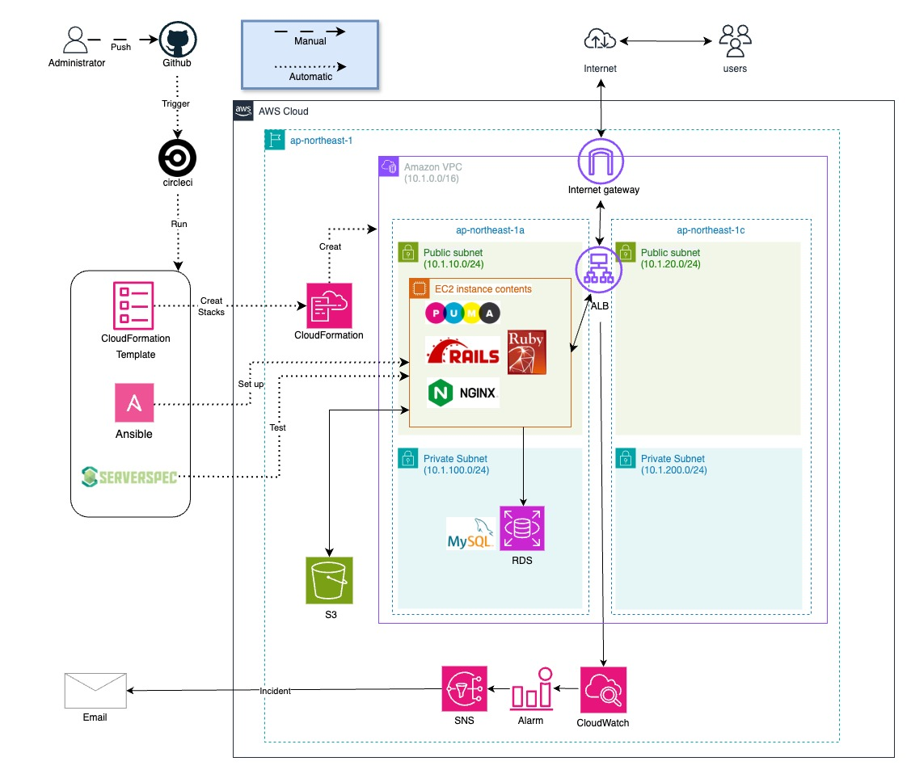

# RaiseTech AWS フルコース

## 1 AWSフルコースの概要
- Amazon Web Servicesの基本的な使い方から、現場2～3年程度までのエンジニアの技術や思考までの習得。   
- AWSのみでなく、クラウドエンジニアに必要な各サービス、ツール、知識、セキュリティ対策等について、実演を交えた講義と、自走力を意識した課題学習。
- 詳細は下記「4 各回の講義内容と課題」のとおり。

## 2 課題により習得
- GitHub/Gitを活用した開発
- IAMの権限管理,CloudTrail,CloudWatch,Princing Calculator,構成図
- Railsアプリケーションのデプロイ
- VPC,EC2,RDS,ALB,S3の環境構築(手動)
- 同環境構築の自動化（CloudFormation,CircleCI,Ansible,Serverspec)

## 3 インフラ構成図  
学習により、構築できるようになったRailsアプリケーションが動作可能なクラウドインフラ環境。  
  
  

## 4 各回の講義内容と課題

|各回|講義の内容|提出課題|学んだこと| 
|---|---|---|---| 
|1|クラウドインフラが変えたもの・インフラエンジニアとは・開発環境の構築|（課題なし）|<li>AWSアカウント作成</li><li>IAM設定、Cloud9作成</li>| 
|2|バージョン管理システム|[第2回課題](./lecture02.md)</li>|<li>GitHub/Gitを使った開発</li><li>MarkdownでREADME作成</li>|
|3|Webアプリケーション<li>システム開発の流れ</li><li>外部ライブラリと構成管理<li>AP,DBサーバー</li>|[第3回課題](./lecture03.md)|<li>Cloud9でRailsアプリケーションをデプロイ</li><li>AP,DBサーバーの設定確認</li>
|4|クラウドインフラ環境構築(手動)<li>AWSでの権限管理</li><li>VPC（サブネット）,EC2,RDS</li>|[第4回課題](./lecture04.md)|<li>VPC,EC2,RDSの構築</li><li>SSH接続でEC2からRDSへの接続確認</li>|
|5|クラウドインフラ環境構築（手動）<li>アプリケーションのデプロイ<li>ELB,S3,インフラ構成図</li>|[第5回課題](./lecture05.md)|<li>第4回課題環境にアプリケーションをデプロイ</li><li>ALB,S3追加、構成図作成</li>
|6|システムの安定稼働<li>AWSでの証跡,ロギング,監視,アラーム通知,コスト管理</li> | [第6回課題](./lecture06.md)</li>|<li>CloudTrailで証跡確認</li><li>CloudWatchでアラーム通知</li><li>Princing Calculatorで見積作成</li>|
|7|システムにおけるセキュリティの基礎<li>想定リスクと要因、AWSの機能（WAF,ACM,KMS,Shield,GuardDuty等）</li>|[第7回課題](./lecture07.md)|<li>第5回課題環境の脆弱性と、対策について考察</li>|
|8|構築の実演1<li>VPC、EC2、RDS 構築</li><li>アプリケーションのデプロイ</li><li>ELBの構築、アプリとELBの接続</li>|―|―|
|9|構築の実演2<li>アプリケーションサーバー構成の変更</li><li>同環境でのELB接続確認</li>|―|―|
|10|インフラ自動化<li>CloudFormation</li>|[第10回課題](./lecture10.md)|<li>第5回課題（VPC,EC2,RDS,ALB,S3）をCloudFormationで自動化</li>|
|11|インフラのテスト<li>テスト駆動開発</li><li>Serverspec</li>|[第11回課題](./lecture11.md)|<li>Serverspecを使ったテストの実行</li>
|12|Terraform・DevOps・CI/CD<li>Terraform</li><li>CircleCI</li>|[第12回課題](./lecture12.md)|<li>GitHubとCircleCIを連携</li><li>CloudFormation実行時の自動テスト環境構築</li>
|13|構成管理(プロビジョニング)ツール<li>Ansible</li><li>CircleCIとの併用</li> |[第13回課題](./lecture13.md)|<li>GitHubリポジトリへのコードPushに連動し、CircleCiがworkflowを実行（CloudFormation,Ansible,Serverspec)</li>|
|14,15|ライブコーディング（AnsibleやCircleCIの導入を実演）|―|―|
|16|現場へ出ていくにあたって必要な技術と知識・現場での立ち振る舞い|―|―|
