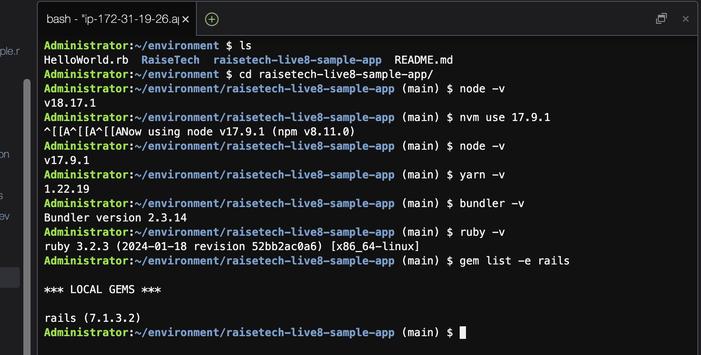
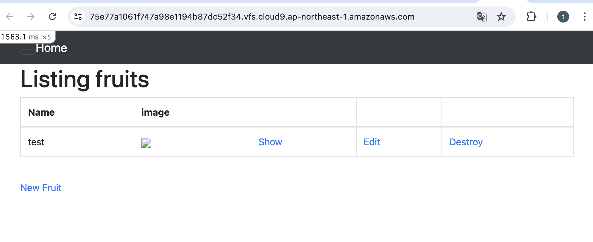

# 第三回課題の報告について

## 課題の回答

1. アプリケーションのREADMEに従った、各種バージョン設定の状況

2. アプリケーションをデプロイした時の状況

    APサーバ名「puma」、バージョン「６.４.２」
.png)

3. デプロイした時のブラウザ表示

4. pumaを停止してデプロイした時のブラウザ表示

    引き続きアクセスは出来ませんでした。
.png)

5. MySQLを起動した状況

    DBサーバー名「MySQL Community Server」、バージョン「８.４.１」
.png)

6. MySQLを停止させてデプロイした状況

    アクセスはできなかった。
.png)

7. MySQLを停止させてデプロイした時のブラウザ表示
.png)

8. Railsの構成管理ツールの名前

    「Bundler」

## 今回の課題から学んだこと、感じたこと
今回の課題は、Webアプリケーションを中心に、以下のことについて学んだ。
* クライアント、サーバ
* リクエスト、リスポンス
* 通信
* HTTPメソッド
* HTML/CSS/JS
* アプリケーション開発の流れ
* Ruby on Rails によるWebアプリケーションの起動
* 外部ライブラリと構成管理の重要性
* GemとBundler
* アプリケーションサーバ
* DBとSQL

特に、クラウド９上でサンプルのWebアプリケーションをデプロイする作業については、講義と同じように作業しているつもりでも様々なエラーが発生し、対応に苦心した。「nodeとyarnのバージョン整合性」「gemインストール時のフリーズ対してスワップ領域を活用」、「アプリケーション実行時のエラーに対して、環境設定でのソケット修正」など、様々な事象に対応するには、エラーを読み解く力が重要だと実感した。
