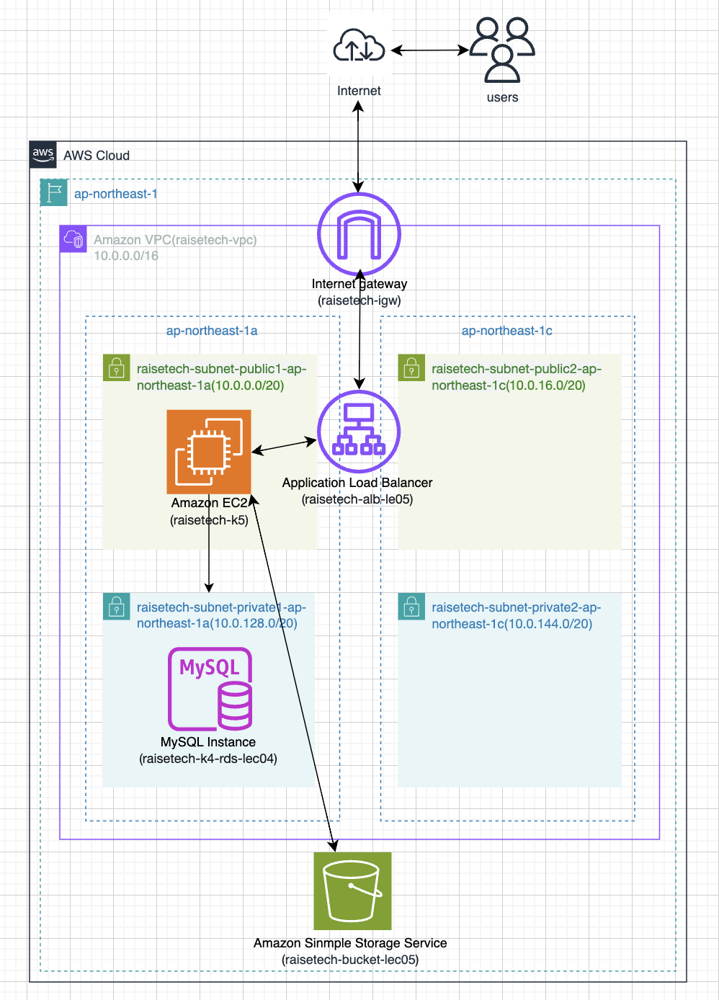

# 第5回課題について

## 概要

EC2上に、Railsを使ったサンプルアプリケーションをデプロイ。RDS、ELB（ALB）、S3を使用して動作確認した後、構成図を作成する。

1.  EC2上のPuma組み込みサーバーで、Railsアプリケーションを構築

EC2で「bin/dev」を実施した状況を、ターミナルとブラウザから確認した。

2.  pumaのリッスン設定にUnixSocketを使用し、curlでの動作確認

curlを使用したpumaの動作確認を実施した。

3.  nginxの単体起動確認

nginxを単体で実施した状況を、ターミナルとブラウザから確認した。

4.  puma(組み込みサーバー)、nginxをUnixSocketを合わせた動作確認

pumaとnginxを組み合わせて動作させた状況をターミナルとブラウザから確認した。

5.  ALBの追加

外部とEC２間の通信にALBを追加し、EC2に対する負荷分散等を想定。

ALBの詳細について。

ALBを追加し、ブラウザ上で動作確認した。

ALBに設定したターゲットグループについて。

６.  S3追加  

S3をアプリケーションの画像のstorageとして活用する。

作成したS3のバケット概要について。

S3に接続した後、画像を保存した状況をブラウザで確認。

S3に画像が保存された状況を確認。

S3に保存された画像を表示させた状況。

6.  構成図

本課題を構成図に表した。

## 今回の課題から学んだことと、感じたこと

第5回講義では以下のことを学んだ。
* EC2環境に対するアプリケーションのデプロイ
* 冗長化・負荷分散について（ELB経由でEC2へ接続）
* S3について（アプリケーションのデータ保存先、その他の役割等）
* インフラ構成図

実際に EC2にSSH接続し、 Railsサンプルアプリケーションをデプロイした。

作業中のエラー対応としては、「bin/dev実施後、webpackerのコマンドが見当たらないというメッセージが出ていたが、yarn add yarn@1.22.19の実施で解決した。」、「UnixSocketで接続を行う際、nginxがPuma.sockへの接続許可がされずパーミッションエラーを起こしていたので、nginxのユーザー名を接続権限があるアカウントに変えた。」その他うまくいかない時はウェブ資料を参考にして進めたが、試しているうちに設定がごちゃごちゃになってしまい、EC2を作り直したらうまく行くこともあった。

エラー対応に対する対応が慣れてきた気がする。引き続き勉強を続けていきたい。

