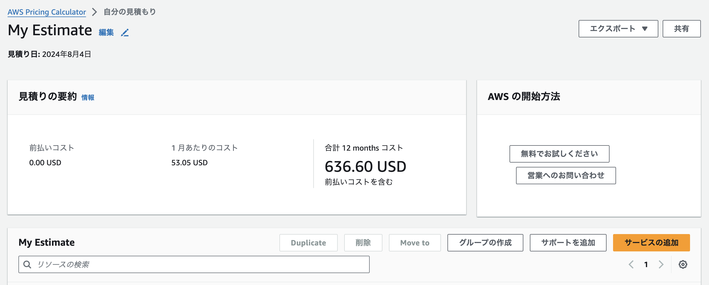

# 第6回課題について

## 概要

* CloudTrailを用いて、AWS利用記録の最終日のイベントから、イベント名等３項目をピックアップ
* CloudWatchのアラーム（OKアクション設定あり）の動作確認
* AWS利用料の見積作成（URLを共有）
* マネジメントコンソールから、現在の利用料を確認（先月分のEC2料金、無料枠について）

1. CloudTailの記録

最終日の記録のうち、PutMetricAlarmの詳細を表示させた画像。

同記録のうち、イベントレコードを表示させた画像。記録の内容から、「実行したアカウントのユーザー名はAdministrator」、「実行日時は２０２４年８月２日午後4時28分43秒（JST）」、「イベント名がPutMetricAlarm（アラームのメトリクスの設定）」「アクセス元のIPアドレスが１０６.１５４.１４５.６２」等が判明した。

2.  CloudWatchのアラームの記録
アラーム（ALBに紐づくEC2インスタンスがUnhealthy）の詳細を表示させた画像。

「アラーム状態」と「OK」の履歴を表示させた画像。

「アラーム状態」（Unhealthy）の時に送信されたメール

「OK」（Healthy）の時に送信されたメール

3. AWS利用料の見積
自分の利用状況を元に作成した見積を表示させた画像。（共有URL　　　　　　https://calculator.aws/#/estimate?id=8b1132818165e0a92388a6e0bb9e0916d2bb91d0）

4. 自分の現在の利用料

７月分の請求を表示させた画像。

7月のコストのうち、サービスを「EC2インスタンス」に限定して表示させた画像。

無料利用枠の現在の使用量を表示した画像。（該当のサービスは無料枠内に収まっていることを確認）

## 今回の課題から学んだことと、感じたこと

第6回講義では以下のことを学んだ。
* AWSでの証跡、ロギングについて(CloudTrail等)
* AWSでの監視、通知(CloudWatch等)
* AWSでのコスト管理

ログなどの証跡を残していないと、障害対応ができない等、ログの重要性を感じた。CloudWatchではアラートとして登録できる項目が多数あり、実際の設定方法も多岐にわたるので、どのサービスにアラートを設定するか等、判断する力が重要だと感じた。引き続き勉強を続けたい。

