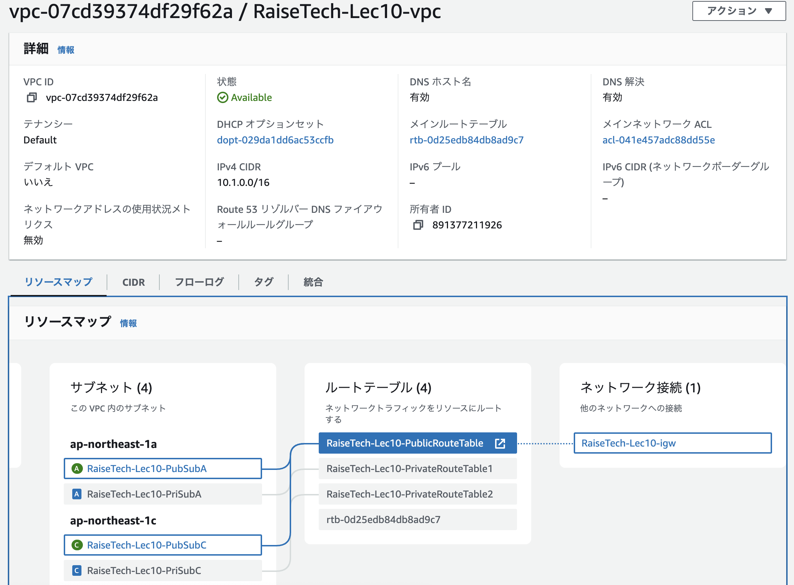
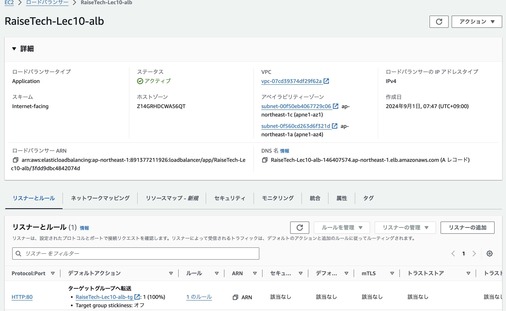

# 第10回課題について

## 概要

* 課題5で作成した環境をCloudFormationで自動設定
* VPC,EC2,RDS,ALB,S3を作成
* テンプレートはyamlを使用

## 1. VPCの状況  
&emsp;作成したVPCの設定画像  

## 2. EC2の状況  
&emsp;作成したEC2の設定画面  

  

  

  

## 3. RDSの状況   
&emsp;作成したRDSの設定画面  

  

  

 

## 4. ALBの状況  
&emsp;作成したALBの設定画面  

  

## 5. S3の状況    
&emsp;作成したS3の設定画面  

  

## 6. インターネットゲートウェイの状況  
&emsp;インターネットゲートウェイの設定画面  

  

## 7. ターゲットグループの状況  
&emsp;ターゲットグループの設定画面    

  

## 8. EC2への接続確認  
&emsp;SSHでEC2に接続した状況の画面  

  

## 9. テンプレート  
 - [**vpc.yaml**](/template10/vpc.yaml)    
 - [**security.yaml**](/template10/security.yaml)  
 - [**resources.yaml**](/template10/resources.yaml)  

 
## 10. 今回の課題から学んだことと、感じたこと  
第10回講義では、CloudFormationにおいて、作成したテンプレートを使用した環境構築の自動化について学んだ。  

VPCのテンプレート作成から行ったが、最初はCloudFormationの書式や関数などの理解に時間がかかった。書式について理解してから、課題5の環境を元にテンプレート作成を進めた。ウェブで学んだことはテンプレートにコメントとして残したが、タブとスペースを混在させてしまったこと等、うまく反映できず、エラー対応に時間がかかった。  
テンプレートによる自動化は実務でも使うと思うので、今回使わなかった設定など学習を続けていきたい。

