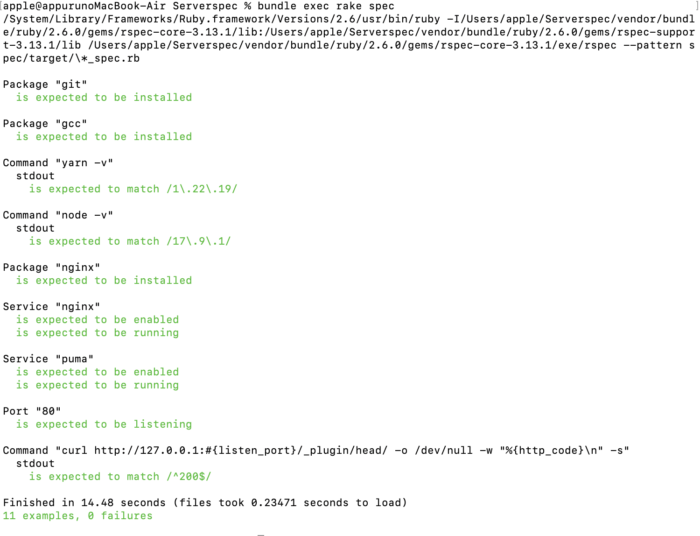

# 第11回課題について

## 概要

* ServerSpecを利用したテストの実行
* サンプルのテストコードを参考にし、課題5で作成した環境に対してテストを実施した
* 「Nginxがインストール済みであること」「指定のポートがリッスンであること」「テスト接続して動作すること」が最低条件

## 1. Serverspecインストール後の環境  
&emsp;Serverspecインストール時、ホスト名を「target」と設定し、以下の画像のとおりのファイル構成となった。

## 2. テストの実施結果  
&emsp;課題5の環境に対し、SSH接続でテストを実施した結果  

  

## 3. テストコードのテンプレート  
 - [**sample_spec.rb**](/template11/sample_spec.rb)      

 
## 4. 今回の課題から学んだことと、感じたこと  
&emsp;第11回講義では、インフラ環境に対するテストの重要性について学び、そのツールについての使い方を学んだ。特に、課題として「Serverspec」に取り組んだ。
  
&emsp;最初は「serverspec-init」でのhost nameの設定が何を指しているのかや、configファイルの理解について調べ、SSH接続でテストする環境を整えた。テストコードについては、多様な書き方があることがわかったので、今回導入したコード以外にも引き続き学習していきたい。
