# 第13回課題について

## 概要

* CircleCIiにAnsibleとServerspecの処理を追加して実行する
- 実際の実行環境
[実際に実行したリポジトリ](https://github.com/kubota-tk/circleci-raisetech13)

## 1. CircleCIに環境変数とSSHを設定  
&emsp;CircleCI上で、環境変数「AWS_ACCESS_KEY_ID」「AWS_DEFAULT_REGION」「AWS_SECRET_ACCESS_KEY」を設定した。
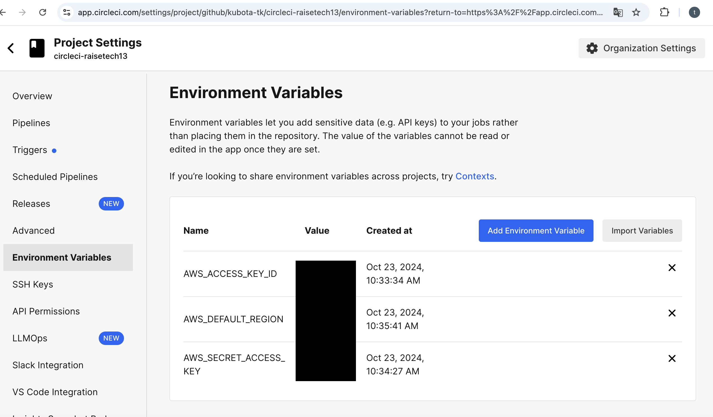  

&emsp;CircleCI上で「SSH Key」を設定した。
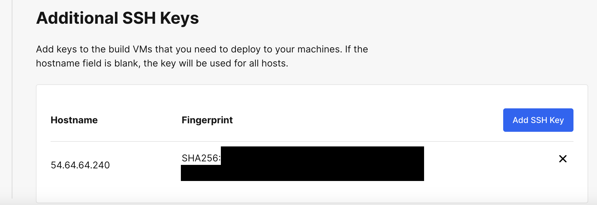  

template
 - [**config.yml**](/template13/circleci/config.yml)  

## 2. Cloudformationの実施結果  
&emsp;CircleCI上で、Cloudformationのテンプレートを自動実行し、「VPC」、「EC2」、「RDS」、「ALB」、「S3」を作成した。
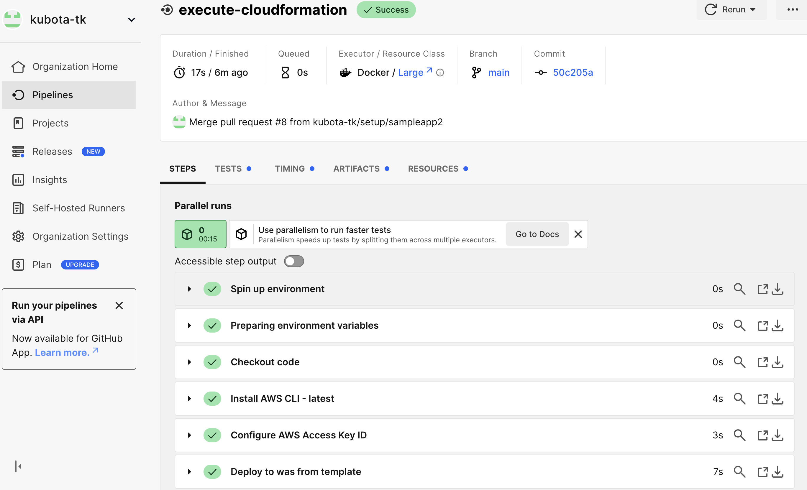  

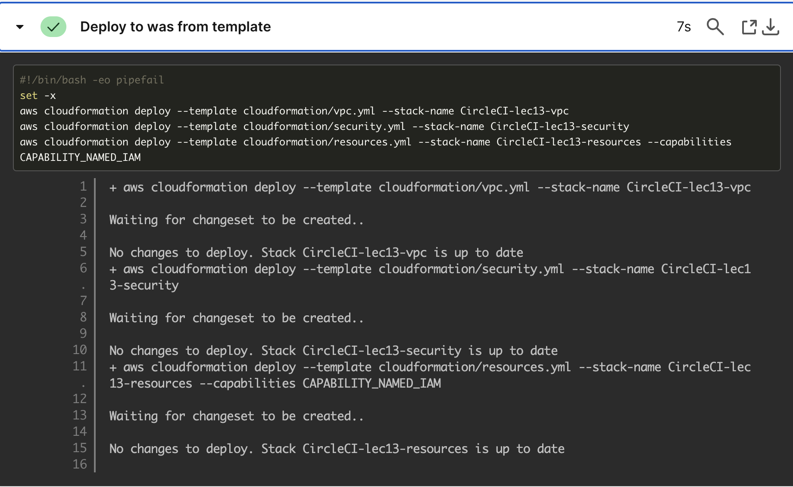  

template
 - [**vpc.yml**](/template13/vpc.yml)  
 - [**security.yml**](/template13/security.yml)  
 - [**resources.yml**](/template13/resources.yml)  

## 3.Ansibleの実施結果  
&emsp;CircleCI上でAnsibleをインストールし、コントロールノードとした。AWS上のEC2をターゲットノードとして、playbook、tasks等で「yumのアップデートとインストール」、「gitのインストール」、「MySQLのインストールと起動」、「Nginxのインストールと起動」を設定。
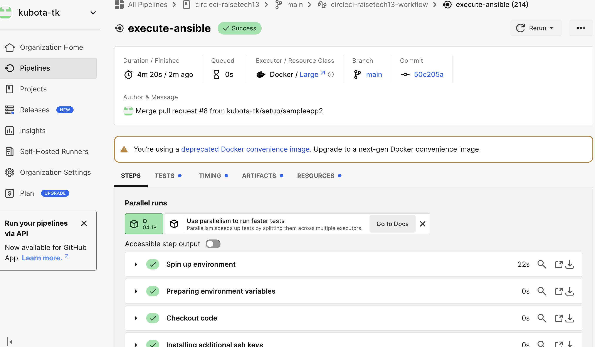  

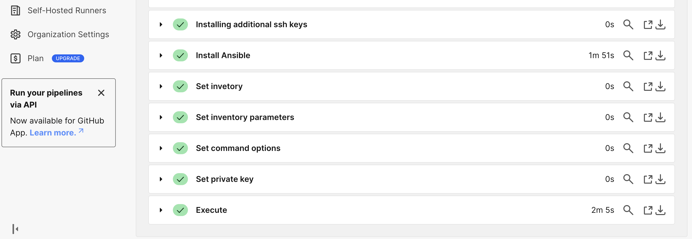  

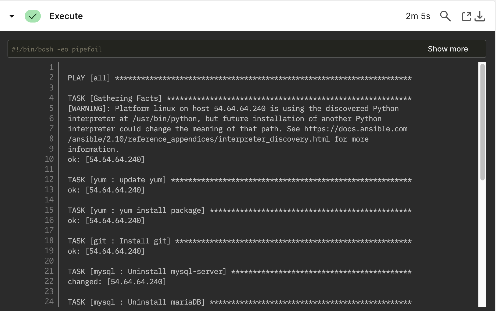  

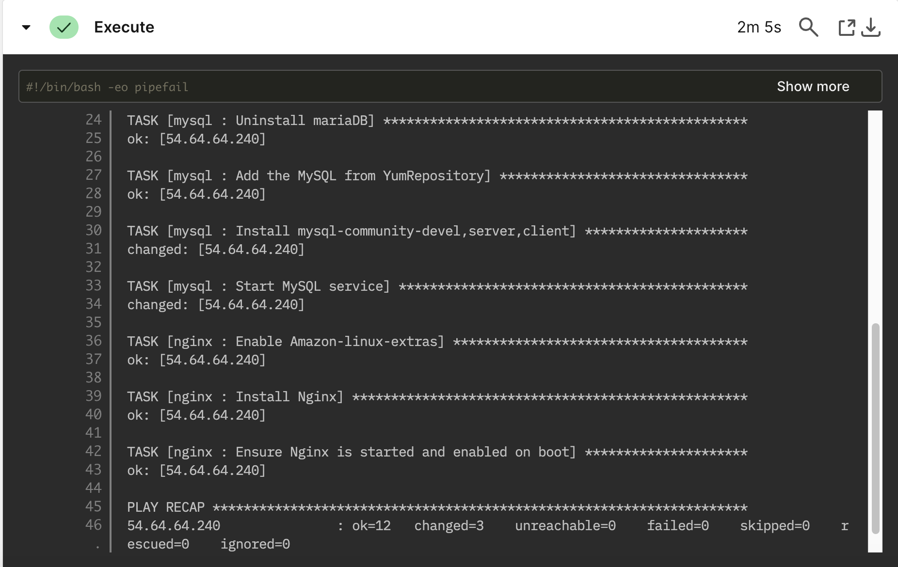   

template
 - [**inventory.yml**](/template13/inventory.yml)  
 - [**playbook.yml**](/template13/playbook.yml)  
 - [**main.yml(yum)**](/template13/yum/tasks/main.yml)  
 - [**main.yml(git)**](/template13/git/tasks/main.yml)  
 - [**main.yml(mysql)**](/template13/mysql/tasks/main.yml)  
 - [**main.yml(nginx)**](/template13/nginx/tasks/main.yml)  

## 4.Serverspecの実施結果  
&emsp;CircleCI上で、Serverspecのテンプレートを実行し、「rubyのインストール」、「gitとnginxのインストールについてのテスト」を実施。
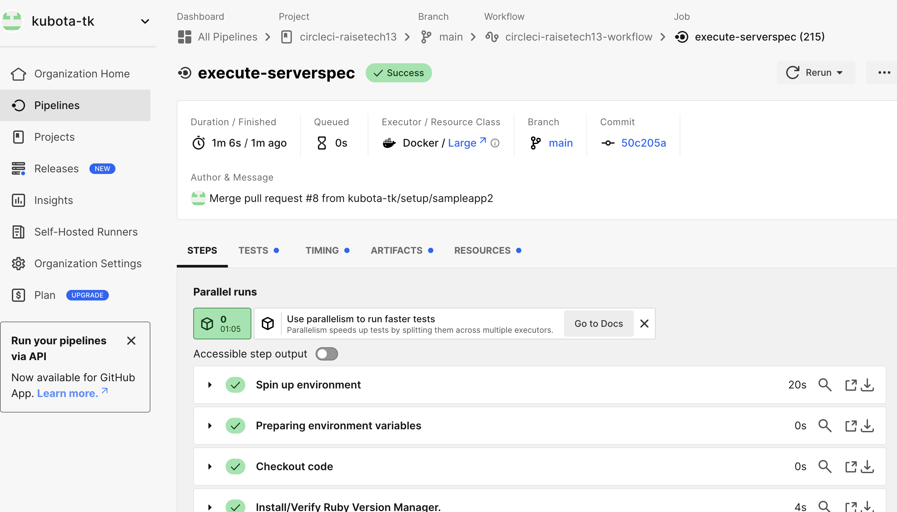  

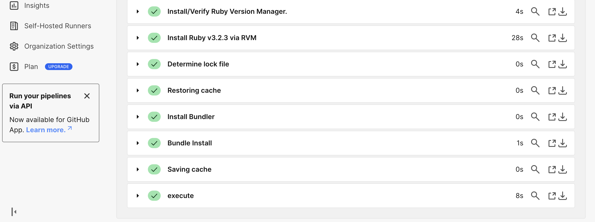  

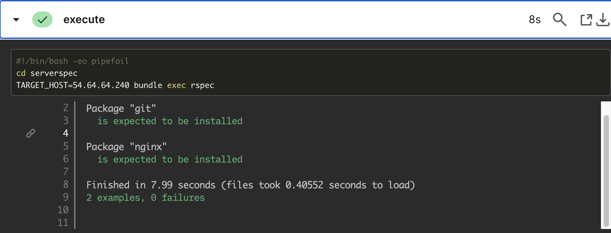  

template
 - [**Gemfile**](/template13/Gemfile)  
 - [**sample_spec.rb**](/template13/54.64.64.240/sample_spec.rb)

## 5. 今回の課題から学んだことと、感じたこと
&emsp;CircleCI上でAnsibleやServerspecを組み合わせることで、手作業での反復作業は自動実行で時間短縮が可能、かつ、ミスも減らせると実感した。
&emsp;アプリの導入に関しても自動実行させるには、Playbookやtasksをさらに発展させていく必要があり、引き続き学習の必要性を感じている。

